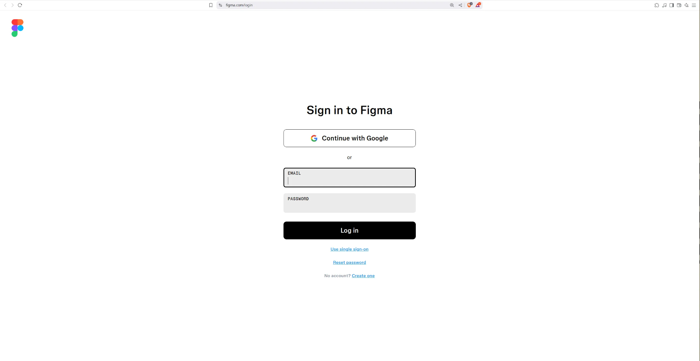
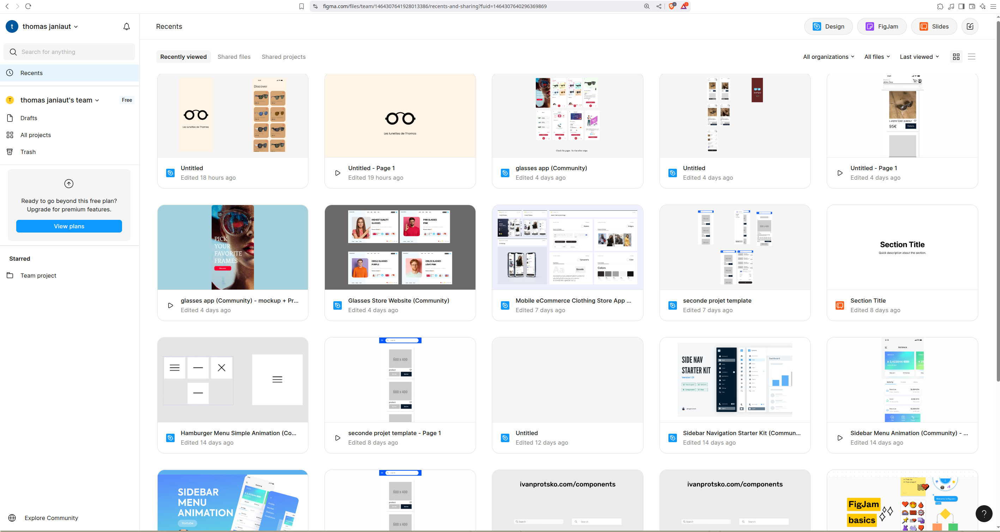
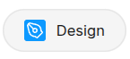
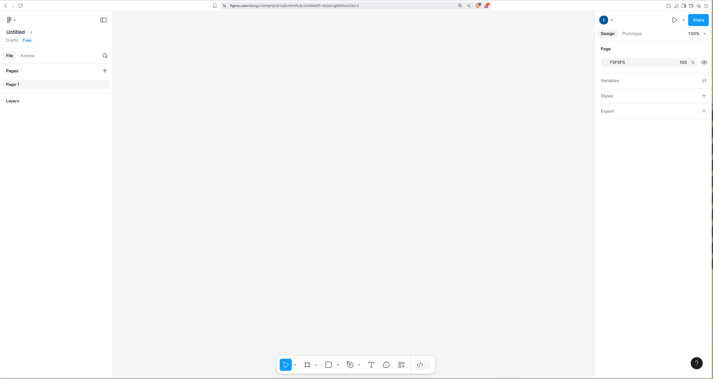

# Atelier VMV de Product Designer : Figma

[Partie 1: Première application ](Atelier%20VMV%20de%20Product%20Designer%20Figma%201eb21bfd6dd780cdbdcac3dbfc12ab99/Partie%201%20Premie%CC%80re%20application%201eb21bfd6dd7800da176ed1b4cf1e2c6.md)

[Partie 2: Page d’accueil ](Atelier%20VMV%20de%20Product%20Designer%20Figma%201eb21bfd6dd780cdbdcac3dbfc12ab99/Partie%202%20Page%20d%E2%80%99accueil%201eb21bfd6dd78032b288ea4d8538d216.md)

[Partie 3: Premier produit](Atelier%20VMV%20de%20Product%20Designer%20Figma%201eb21bfd6dd780cdbdcac3dbfc12ab99/Partie%203%20Premier%20produit%201eb21bfd6dd780659c16efe16a52cdc1.md)

[Partie 4: Liste des produits](Atelier%20VMV%20de%20Product%20Designer%20Figma%201eb21bfd6dd780cdbdcac3dbfc12ab99/Partie%204%20Liste%20des%20produits%201eb21bfd6dd7803e8ff2dcfc75f434b5.md)

[Partie 5: Détail de produit](Atelier%20VMV%20de%20Product%20Designer%20Figma%201eb21bfd6dd780cdbdcac3dbfc12ab99/Partie%205%20De%CC%81tail%20de%20produit%201eb21bfd6dd78019ae1ff2ab07952c8a.md)

# Premiers pas

## Connexion à Figma

Cette activité se déroule dans l’outil en ligne https://www.figma.com/login qui nécessite un compte

Vous avez deux possibilités : inscription avec Google ou inscription avec une adresse mail 

<aside>
💡

Chaque participant au stage doit se créer un compte pour pouvoir faire cet atelier

</aside>

Une fois connecté, tu vas arriver sur cette page ⤵️

Maintenant, clique sur le bouton **Design** en haut à gauche de ton écran

Tu vas arriver sur cette page ⤵️

Bravo, tu es au bon endroit pour commencer à construire ta première application mobile ➡️ [Partie 1: Première application ](./base/Partie%201%20Premie%CC%80re%20application.md)